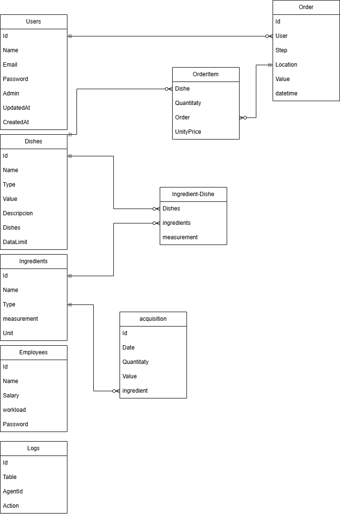

# Author: [João Gabriel Pereira Lopes](https://github.com/JoaoGabrielPereiraLopes)
# Index
- [Project Presentation](#project-presentation)
- [Tecnologies used](#tecnologies-used)
- [Database](#database)
# Project Presentation
This is a website for a fictional restaurant named "Flavor & Company" where I will make a fullstack aplication with three tipes of users.
- Admin: The employees of the restaurant who manage storage and statistics.
- User: The people who want to buy a dish or other service.
- Employee: The employees of the restaurant who manage orders.
# Tecnologies used
- Vue.js
- [Flowbite](https://flowbite.com/)
- Tailwind
- MySQL
- Node.js
- Express
# Database
      
I chose to use a relational database because it allows for more complex queries and ensures a more consistent data structure. The database is made to save data from storage, orders and dishes to be sold, the structure is consistent and made to be simple and practical. The database system used was MySQL, because it's solid, secure, scalable and simple.